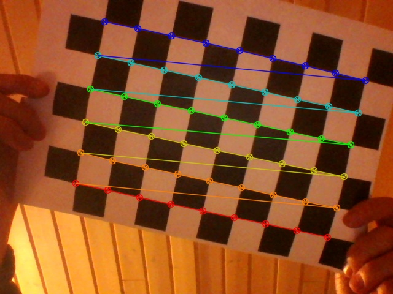
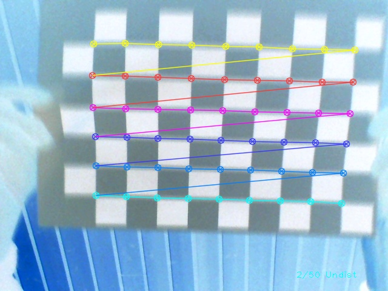
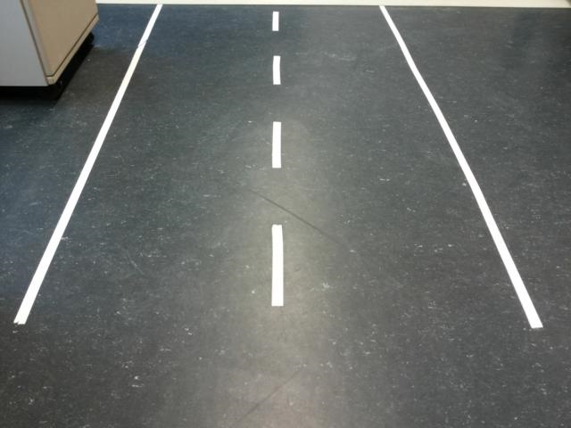
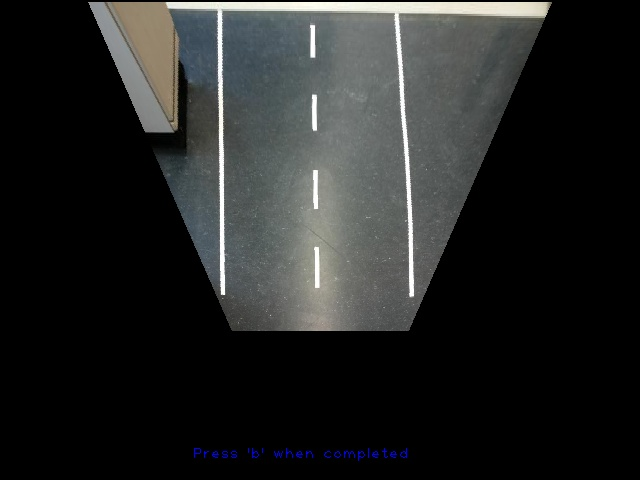

# Calibrationtool
This project calibrates and undistort the videostream of a camera.
Furthermore, the project can transform the input image of the camera into a bird's-eye view.

## Camera calibration
First, a chessboard is detected to compare image points with the real object points.
The settings for this calibration are saved in the folder /settings.

In the image above, a chessboard is detected and lines between the cross points are drawn.
Through this correlation the tool generates the results/calibration_data.xml.
This file contains the intrinsics and extrinsics parameter for the used camera.
Every time when a chessboard is detected, the image is bitwise inverted and the counter increases.
After the 50 images, the program calculates the intrinsics and extrinsics parameter and shows the image.

Commands:
* **g**: start the chessboard detection
* **u**: toggle undistort/distort image after successfull calibration
* **b**: end the program

## Bird-Eye's view calibration
The previous step (and the results/calibration_data.xml) is required to generate a H Matrix.
There are two methods to determine the H Matrix:
* **Chessboard** calibration
* **Manual** calibration

The first method uses algorithms to detect a chessboard in a difficult situation to detect (askew).
The second method provides the functionality to rotate over one axis through a slider.

The calibration is executed with the second method and the results looks like this:

Commands:
* **c**: start the chessboard detection
* **m**: start the manual detection
* **b**: end the calibration